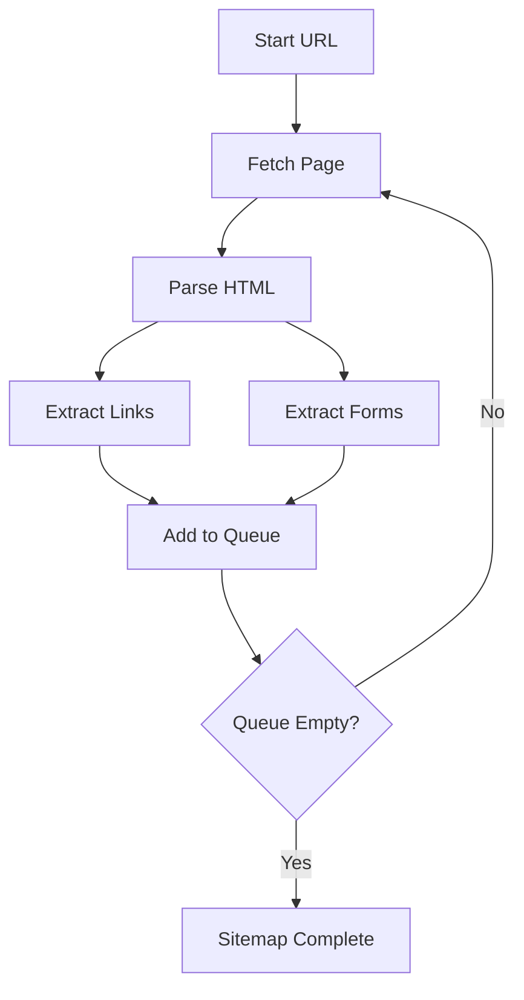

# How Web Security Analyzers Work

## Overview

A **web security analyzer** (also called Web Application Security Scanner) is a tool that crawls a website, analyzes its structure and behavior, and tests it for security vulnerabilities. It operates as both a proxy server and an active scanner.

```
┌──────────────┐         ┌─────────────────┐         ┌──────────────┐
│   Browser    │◄───────►│  Security Tool  │◄───────►│  Target App  │
│  (Client)    │         │  (Interceptor)  │         │   (Server)   │
└──────────────┘         └─────────────────┘         └──────────────┘
```

## Core Components

### 1. Proxy Server

The proxy intercepts ALL HTTP/HTTPS traffic between the browser and web server.

```
Browser Request                          Proxy Intercepts
      │                                        │
      ▼                                        ▼
┌─────────────┐    ┌─────────────┐    ┌─────────────┐
│   Browser   │───►│  INTERCEPT  │───►│   Target    │
└─────────────┘    │   PROXY     │    │   Server    │
                   └─────────────┘    └─────────────┘
                         │
                   ┌─────┴─────┐
                   │           │
              FORWARD      STORE
              Request     for Analysis
```

**Key Features:**
- **HTTP Interception**: Capture requests before sending
- **HTTPS MITM**: Decrypt HTTPS traffic using generated certificates
- **Request Modification**: Edit headers, parameters, cookies
- **Response Inspection**: Analyze server responses
- **History Logging**: Store all traffic for later analysis

### 2. Crawler / Spider

Discovers all accessible pages and endpoints on the target.



**What it discovers:**

| Element | Detection |
|---------|-----------|
| `<a href="">` | Internal/external links |
| `<form action="">` | Form endpoints |
| `` | Static resources |
| `<script src="">` | JavaScript files |
| JavaScript `fetch()` | Dynamic API calls |
| JavaScript `axios()` | Dynamic API calls |
| JavaScript routes | `router.get()`, `app.use()` |

### 3. Active Scanner

Sends malicious payloads to test for vulnerabilities.

```
┌─────────────────────────────────────────────────────────────┐
│                    ACTIVE SCANNING FLOW                      │
├─────────────────────────────────────────────────────────────┤
│                                                              │
│   1. GET endpoints from crawler                              │
│          │                                                   │
│          ▼                                                   │
│   2. Identify injection points                              │
│      ├── URL parameters (?id=1)                             │
│      ├── POST body parameters                               │
│      ├── Headers (User-Agent, Cookie)                       │
│      └── Forms (input fields)                               │
│          │                                                   │
│          ▼                                                   │
│   3. Send baseline request (no payload)                      │
│      └── Record: status, response body, time               │
│          │                                                   │
│          ▼                                                   │
│   4. Send attack requests (with payloads)                   │
│      ├── SQL Injection: ' OR 1=1--                         │
│      ├── XSS: <script>alert(1)</script>                    │
│      ├── Path Traversal: ../../etc/passwd                  │
│      └── Command Injection: ; whoami                        │
│          │                                                   │
│          ▼                                                   │
│   5. Compare responses                                       │
│      ├── Status code changes                                │
│      ├── Response body differences                          │
│      ├── Response time differences                          │
│      └── Error message detection                            │
│          │                                                   │
│          ▼                                                   │
│   6. Vulnerability confirmed?                               │
│      ├── Yes → Log finding + severity                      │
│      └── No  → Continue to next test                        │
│                                                              │
└─────────────────────────────────────────────────────────────┘
```

### 4. Passive Scanner

Analyzes existing traffic WITHOUT sending new requests.

```
┌─────────────────────────────────────┐
│         PASSIVE SCANNING             │
├─────────────────────────────────────┤
│                                      │
│  For each captured request/response: │
│                                      │
│  ✓ Check security headers            │
│    - Content-Security-Policy         │
│    - X-Frame-Options                │
│    - X-Content-Type-Options         │
│    - Strict-Transport-Security      │
│                                      │
│  ✓ Check for information leakage    │
│    - Stack traces in responses       │
│    - Debug endpoints                 │
│    - Version disclosure              │
│    - Path disclosure                 │
│                                      │
│  ✓ Technology fingerprinting        │
│    - Server header                   │
│    - Cookie patterns                │
│    - HTML comments                   │
│    - JS library versions            │
│                                      │
│  ✓ Sensitive data detection          │
│    - API keys in URLs               │
│    - Tokens in response             │
│    - Credit card patterns           │
│    - Passwords in HTML              │
│                                      │
└─────────────────────────────────────┘
```

---

## Vulnerability Detection Methods

### SQL Injection Detection

```
NORMAL REQUEST:
GET /product?id=5

PAYLOAD 1 (Error-based):
GET /product?id=5' 

Response: "You have an error in your SQL syntax"

PAYLOAD 2 (Boolean-based):
GET /product?id=5 AND 1=1
Response: Product found (200 OK)

GET /product?id=5 AND 1=2
Response: No product found (404)

PAYLOAD 3 (Time-based):
GET /product?id=5; SLEEP(5)

Response: 5+ seconds delay = VULNERABLE
```

### XSS Detection

```
REFLECTED XSS:

Normal: GET /search?q=laptop
Response: "Results for laptop"

Payload: GET /search?q=<script>alert(1)</script>
Response: "Results for <script>alert(1)</script>"
                              ^^^^^^^^^^^^^^^^^^
                              Reflected unsanitized

STORED XSS (via form submission):

POST /comment
Body: comment=<script>alert(1)</script>

Later GET /post/123
Response: Contains <script>alert(1)</script>
```

### Path Traversal Detection

```
NORMAL: GET /download?file=report.pdf
Response: PDF file content

PAYLOAD: GET /download?file=../../etc/passwd
Response: /etc/passwd content displayed

PAYLOAD: GET /download?file=..%2F..%2F..%2Fetc%2Fpasswd
Response: /etc/passwd content displayed (URL encoded)
```

### Command Injection Detection

```
VULNERABLE CODE (example):
system("cat " . $_GET['file']);

PAYLOAD: GET /page?file=/etc/passwd
Response: File contents displayed

PAYLOAD: GET /page?file=| whoami
Response: "www-data"

PAYLOAD: GET /page?file=; ls -la
Response: Directory listing
```

---

## How Burp Suite Works

### Architecture

```
┌────────────────────────────────────────────────────────────────┐
│                      BURP SUITE PRO EDITION                    │
├────────────────────────────────────────────────────────────────┤
│                                                                 │
│  ┌─────────────┐    ┌─────────────┐    ┌─────────────────┐    │
│  │   Proxy     │───►│  Target      │───►│   Spider        │    │
│  │   (8080)    │    │  Site Map    │    │   (Crawler)     │    │
│  └─────────────┘    └─────────────┘    └─────────────────┘    │
│         │                                       │               │
│         │          ┌─────────────┐              │               │
│         └────────►│  Intruder   │◄─────────────┘               │
│                   │  (Fuzzer)    │                             │
│                   └─────────────┘                             │
│                         │                                      │
│                   ┌─────┴─────┐                                │
│                   │  Scanner  │                                │
│                   │  (Active)  │                                │
│                   └───────────┘                                │
│                         │                                      │
│                   ┌─────┴─────┐                                │
│                   │ Repeater  │                                │
│                   │ Decoder   │                                │
│                   │ Comparer   │                                │
│                   └───────────┘                                │
│                                                                 │
└────────────────────────────────────────────────────────────────┘
```

### Proxy Workflow

```python
# Simplified Burp Proxy Logic
class ProxyInterceptor:
    def handle_request(self, request):
        # 1. Store in history
        self.history.append(request)
        
        # 2. Match rules (redirect, block, modify)
        if self.match_rule(request):
            return self.apply_rule(request)
        
        # 3. Forward to server
        response = self.forward(request)
        
        # 4. Passive scan response
        self.passive_scanner.scan(request, response)
        
        # 5. Return response to browser
        return response
```

### Scanner Module

Burp's scanner uses:
1. **Knowledge base** of vulnerability signatures
2. **Insertion points** - where to inject (URL, params, headers)
3. **Payload sources** - lists of test strings
4. **Response analysis** - what changes indicate vulnerability

---

## How OWASP ZAP Works

### Architecture

```
┌──────────────────────────────────────────────────────────────────┐
│                        OWASP ZAP                                  │
├──────────────────────────────────────────────────────────────────┤
│                                                                   │
│  ┌──────────┐     ┌──────────┐     ┌──────────┐                  │
│  │  Local   │────►│  Core    │────►│ Spider   │                  │
│  │  Proxy   │     │  Engine  │     │ (Crawl)  │                  │
│  └──────────┘     └──────────┘     └──────────┘                  │
│                         │                                        │
│                         ▼                                        │
│  ┌─────────────────────────────────────────────────────┐        │
│  │                    Active Scanner                    │        │
│  ├─────────────────────────────────────────────────────┤        │
│  │                                                      │        │
│  │  [SQLi] [XSS] [Path Trav] [Cmd Inj] [SSRF] [CSRF]  │        │
│  │                                                      │        │
│  └─────────────────────────────────────────────────────┘        │
│                         │                                        │
│                         ▼                                        │
│  ┌─────────────────────────────────────────────────────┐        │
│  │                  Passive Scanner                    │        │
│  ├─────────────────────────────────────────────────────┤        │
│  │                                                      │        │
│  │  [Headers] [Cookies] [Forms] [Info Disclosure]     │        │
│  │                                                      │        │
│  └─────────────────────────────────────────────────────┘        │
│                                                                   │
└──────────────────────────────────────────────────────────────────┘
```

### ZAP Attack Modes

```
┌─────────────────────────────────────────────────────────────┐
│                    SCANNING STRATEGIES                       │
├─────────────────────────────────────────────────────────────┤
│                                                              │
│  SAFE MODE (Default)                                         │
│  ├── Respects robots.txt                                   │
│  ├── No destructive requests                               │
│  └── Low latency between requests                          │
│                                                              │
│  PROTECTED MODE                                             │
│  ├── Only scans within defined scope                       │
│  └── Prevents accidental out-of-scope attacks              │
│                                                              │
│  STANDARD MODE                                              │
│  ├── Full active scan                                       │
│  └── No restrictions                                       │
│                                                              │
│  ATTACK MODE                                                │
│  ├── Aggressive scanning                                    │
│  ├── Rapid requests                                         │
│  └── May cause DoS                                          │
│                                                              │
└─────────────────────────────────────────────────────────────┘
```

---

## Key Differences: Burp vs ZAP

| Feature | Burp Suite | OWASP ZAP |
|---------|------------|-----------|
| **Cost** | Commercial (Pro ~$400/yr) | Free & Open Source |
| **Proxy** | Full intercept | Full intercept |
| **Crawler** | Basic | More aggressive |
| **Scanner** | Better detection | Good detection |
| **Extensibility** | Extensions (.bapp) | Add-ons, API |
| **Automation** | Good | Excellent (API) |
| **Learning Curve** | Steeper | Easier |
| **Active Scanning** | Manual + Automated | Fully automated |

---

## Building Your Own Analyzer

### High-Level Architecture

```
┌─────────────────────────────────────────────────────────────────┐
│                     WEB SECURITY ANALYZER                       │
├─────────────────────────────────────────────────────────────────┤
│                                                                  │
│  ┌──────────────┐                                               │
│  │   CLI/UI     │  ← User interface (click, rich)              │
│  └──────┬───────┘                                               │
│         │                                                        │
│  ┌──────┴───────┐                                               │
│  │   CONFIG     │  ← Arguments, scope, auth                      │
│  └──────┬───────┘                                               │
│         │                                                        │
│  ┌──────┴───────┐                                               │
│  │   CRAWLER    │  ← Discover endpoints                         │
│  └──────┬───────┘                                               │
│         │                                                        │
│  ┌──────┴───────┐                                               │
│  │   SCANNERS   │  ← Test vulnerabilities                        │
│  │  ┌─────────┐ │                                               │
│  │  │   A01   │ │  ← Access Control                            │
│  │  │   A02   │ │  ← Misconfiguration                          │
│  │  │   A05   │ │  ← Injection                                 │
│  │  │   ...   │ │                                               │
│  │  └─────────┘ │                                               │
│  └──────┬───────┘                                               │
│         │                                                        │
│  ┌──────┴───────┐                                               │
│  │   REPORTER   │  ← CLI table, JSON output                     │
│  └──────────────┘                                               │
│                                                                  │
└─────────────────────────────────────────────────────────────────┘
```

### Data Flow

```
User Input          ┌─────────────┐
────────────►       │   Config    │
                    └──────┬──────┘
                           │
                           ▼
                    ┌─────────────┐
                    │   Target   │◄──── robots.txt
                    └──────┬──────┘
                           │
            ┌──────────────┼──────────────┐
            │              │              │
            ▼              ▼              ▼
     ┌───────────┐  ┌───────────┐  ┌───────────┐
     │  Crawler  │  │  Passive  │  │   Auth    │
     │  (Links)  │  │  Scanner  │  │  Module   │
     └─────┬─────┘  └─────┬─────┘  └─────┬─────┘
           │              │              │
           └──────────────┼──────────────┘
                          │
                          ▼
                 ┌─────────────────┐
                 │  Endpoint List  │
                 └────────┬────────┘
                          │
            ┌─────────────┼─────────────┐
            │             │             │
            ▼             ▼             ▼
     ┌───────────┐  ┌───────────┐  ┌───────────┐
     │    A01    │  │    A05    │  │   A07     │
     │  Scanner  │  │  Scanner  │  │  Scanner  │
     └─────┬─────┘  └─────┬─────┘  └─────┬─────┘
           │             │             │
           └─────────────┼─────────────┘
                         │
                         ▼
                 ┌─────────────────┐
                 │   Findings      │
                 └────────┬────────┘
                          │
                          ▼
                 ┌─────────────────┐
                 │     Report      │
                 │  (JSON, CLI)    │
                 └─────────────────┘
```

---

## OWASP Top 10 2025 Detection Matrix

| OWASP Category | Detection Method | Example Payload |
|----------------|------------------|-----------------|
| **A01: Access Control** | IDOR enumeration, forced browsing | `/users/1`, `/admin/` |
| **A02: Misconfiguration** | Header inspection, backup discovery | Check for `.bak` files |
| **A04: Crypto Failures** | Protocol analysis, data leakage | HTTP vs HTTPS check |
| **A05: Injection** | Response diffing, error detection | `' OR 1=1--` |
| **A06: Insecure Design** | Rate limit tests, logic analysis | Burst requests |
| **A07: Auth Failures** | Session analysis, token entropy | Predict session IDs |
| **A09: Logging Failures** | Error message analysis | Stack trace detection |
| **A10: Exception Handling** | Error response analysis | NULL pointer hints |

## Important Concepts

### Rate Limiting

```
SEND 1000 requests in 1 second    ──────►  IP BANNED ❌

SEND 1000 requests with delays    ──────►  Survives ✓

Best Practice:
┌─────────────────────────────────────┐
│  1. Respect robots.txt             │
│  2. Add random delays (0.5-2 sec)  │
│  3. Use polite crawl speed         │
│  4. Follow crawl-delay directive   │
└─────────────────────────────────────┘
```

### Scope Management

```
┌─────────────────────────────────────────────────┐
│                    SCOPE                        │
├─────────────────────────────────────────────────┤
│                                                  │
│  In Scope:          *.example.com                │
│                     /api/*                       │
│                     /admin/*                     │
│                                                  │
│  Out of Scope:     other-domain.com              │
│                    /logout                       │
│                    /static/*                     │
│                                                  │
└─────────────────────────────────────────────────┘
```

### False Positives

```
┌─────────────────────────────────────────────────┐
│              VULNERABILITY VERIFICATION          │
├─────────────────────────────────────────────────┤
│                                                  │
│  1. INITAL DETECTION                            │
│     Payload sent → Response changed              │
│     Status: POTENTIAL VULNERABILITY              │
│                                                  │
│  2. BASELINE COMPARISON                         │
│     Send multiple payloads                        │
│     Compare response patterns                     │
│                                                  │
│  3. CONFIRMATION                                │
│     Verified with different payloads             │
│     Status: VULNERABILITY CONFIRMED             │
│                                                  │
│  4. VALIDATION                                  │
│     Is this a real vulnerability?               │
│     Or just different content?                  │
│     Status: TRUE POSITIVE / FALSE POSITIVE       │
│                                                  │
└─────────────────────────────────────────────────┘
```

## Automation with API

Both Burp and ZAP offer APIs for CI/CD integration:

```
# ZAP API Example
curl "http://zap:8080/JSON/spider/action/scan/?url=https://target.com"

# Burp Professional API
POST /burp/scanner/actions/scan
{
  "target": "https://target.com",
  "scope": ["*.target.com"],
  "scan_config": "Audit seed"
}
```

## Summary

1. **Proxy** intercepts traffic for analysis and modification
2. **Crawler** discovers all accessible endpoints
3. **Passive Scanner** analyzes traffic without sending attacks
4. **Active Scanner** sends payloads to test for vulnerabilities
5. **Reporter** generates findings in readable formats


